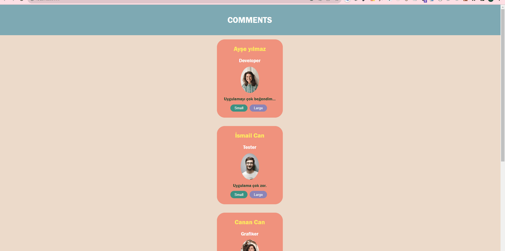

## Project Aim
It is a simple react project I made to learn the sccs module structure.

In the project directory, you can run:

### `yarn install`

### `yarn start`

##  Project Live
[LİVE](https://user-opnn-rct.vercel.app/)

## Technologies

* React
* React DOM
* Props
* Components
* Sccs Module

